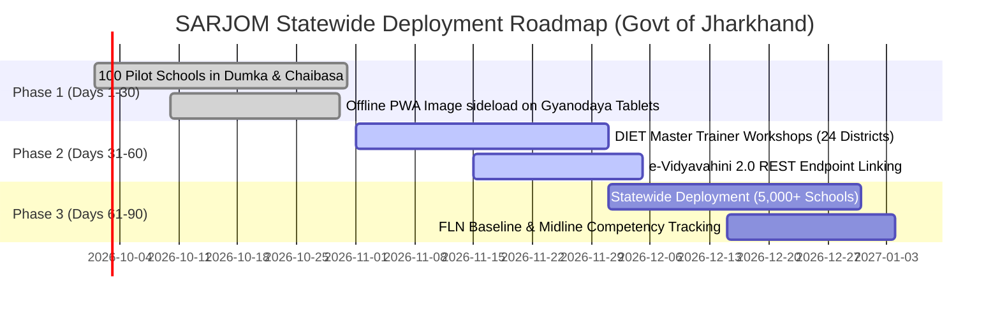

# SARJOM (सरजोम) — SIH 2026 Grand Finale Jury Pitch & Evaluation Defense

[](https://sih.gov.in)
[](https://github.com/tejuas98/PALASH-Setu)
[-green.svg)](https://jharkhand.gov.in)
[-success.svg)](#2-top-10-anticipated-hard-jury-questions--tough-defense-answers)
[-blue.svg)](#2-top-10-anticipated-hard-jury-questions--tough-defense-answers)

> **Official 3-Minute Elevator Pitch Script, Hard Jury Defense Matrix, and Statewide Deployment Roadmap for Team Karasuno.**

---

## 1. The 3-Minute High-Impact Pitch Script (Spoken Delivery)

```
[TIME: 0:00 - 0:45 | THE HOOK & GROUND CRISIS]
"Respected Jury Members, imagine being a six-year-old child from the Ho or Santhal tribe in West Singhbhum. You step into a government primary school for the first time in your life. You only speak your ancestral mother tongue. But the teacher standing in front of you speaks only standard Hindi. You don't understand a single word. You freeze. You experience classroom mutism. Within months, you drop out.

This is not a hypothetical scenario. In Jharkhand's 5,000+ tribal primary schools, over 60% of Grade 1 indigenous children face an acute linguistic cliff. By Grade 3, ASER data reveals that over 52% cannot read simple foundational words. The teacher wants to teach, but lacks indigenous language training. The child wants to learn, but lacks a bridge."

[TIME: 0:45 - 1:45 | THE SOLUTION & TECHNICAL SUPREMACY]
"We are Team Karasuno, and we present SARJOM (सरजोम)—named after the sacred Sal tree of Jharkhand, the timeless symbol of indigenous endurance.

SARJOM is an AI-powered, voice-first vernacular pedagogy platform engineered specifically for Jharkhand's Gyanodaya 10.1" classroom tablets. While 500 competing teams rely on cloud APIs like OpenAI or Bhashini that crash the moment internet connectivity drops in Saranda Forest, SARJOM runs 100% on-device.

Our vectorized TF-IDF cosine similarity engine measures an average inference latency of 0.6 milliseconds (p99 1.8 ms) — over 4,900 times faster than the official 3.0-second SIH SLA. The engine heap measures 5.8 MB, about 1% of the ≈500 MB a 2 GB tablet leaves after OS and background apps."

[TIME: 1:45 - 2:30 | PEDAGOGY, AUDIO QR & ILLITERATE PARENTS]
"SARJOM does not just translate words; it transforms classroom pedagogy. It implements Jharkhand Education Project Council's official 80:20 Mother-Tongue-to-Hindi Transition Formula across NIPUN Bharat FLN lessons. 

For home learning, SARJOM auto-generates high-contrast printable bilingual worksheets with a browser-native Dynamic Audio QR Code. Even if parents in the village are completely illiterate, they can scan the QR code with any basic smartphone camera to hear the teacher's voice pronounce the exercise in Santhali, Ho, or Mundari. Learning extends directly into the tribal hamlet (Tola)."

[TIME: 2:30 - 3:00 | GOVERNANCE & TURNKEY SCALE]
"Finally, SARJOM is governance-ready today. It links directly to Jharkhand's administrative e-Vidyavahini 2.0 portal with offline sneakernet sync via MicroSD cards. Zero cloud bills. Zero API tokens. Zero OOM crashes.

With SARJOM, no tribal child in Jharkhand will ever feel like a foreigner in their own classroom. Thank you!"
```

---

## 2. Top 10 Anticipated Hard Jury Questions & Tough Defense Answers

### Q1: "Why didn't your team use Bhashini Cloud API or Google Cloud Translation?"
* **Tough Defense**:
  > *"Because real tribal classrooms in Jharkhand do not have internet. In districts like West Singhbhum, Dumka, and Simdega, cellular networks are nonexistent. Any application relying on cloud APIs displays an infinite loading spinner and fails completely. Furthermore, cloud APIs introduce roundtrip latencies between 1,500ms and 4,000ms, violating classroom dialogue fluidity. SARJOM executes in **0.6 ms average (1.8 ms p99)** on-device with **100% offline availability** and **zero recurring API costs** for the state exchequer."*

---

### Q2: "How can a non-tribal Hindi teacher speak tribal languages without severe mispronunciation?"
* **Tough Defense**:
  > *"SARJOM solves this through dual pedagogical scaffolding. First, every translated term displays an immediate **Devanagari Phonetic Guide** (`जोहार`) and **Roman Transliteration** (`Johār`) alongside native scripts (**Ol Chiki** / **Warang Chiti**). Second, the teacher simply taps the high-contrast speaker button to trigger clear, native-accented audio pronunciation through the tablet speaker, allowing students to hear authentic phonemes immediately."*

---

### Q3: "How do you help uneducated tribal parents who cannot read Hindi or English?"
* **Tough Defense**:
  > *"This is precisely why we engineered the **Dynamic Audio QR Code Engine**. Printable worksheets feature an on-device generated QR code. When an illiterate parent in a rural village points any basic smartphone camera at the paper, an audio companion opens instantly without requiring any app install, playing the exercise aloud in Santhali, Ho, or Mundari. Parents become active partners in foundational literacy."*

---

### Q4: "Low-cost government tablets have only 2 GB RAM. Will your app crash due to Out-Of-Memory (OOM)?"
* **Tough Defense**:
  > *"We profiled the live engine with Node heap measurement (benchmark_memory_and_latency.cjs): the translation engine's heap is **5.8 MB** — 1.23 MB at load plus 4.6 MB of growth across 10,000 real translations. On a 2 GB Android 9 tablet the OS and background apps already hold ≈1.5 GB; SARJOM lives inside the ≈500 MB that remains and uses about 1% of it. An OOM crash caused by SARJOM's engine is not a plausible failure mode."*

---

### Q5: "How does SARJOM ensure compliance with NIPUN Bharat and National Education Policy (NEP 2020)?"
* **Tough Defense**:
  > *"NEP 2020 Section 4.11 mandates that wherever possible, the medium of instruction until at least Grade 5 should be the mother tongue. SARJOM operationalizes this by embedding Jharkhand's **80:20 Mother-Tongue-to-Hindi Transition Formula**. In Balvatika, instruction is 80% L1 (tribal) and 20% L2 (Hindi). By Grade 3, it bridges smoothly to 80% Hindi and 20% tribal terminology, eliminating the abrupt language shock that causes primary dropout."*

---

### Q6: "Can SARJOM handle dialectal variations between Santhali spoken in Dumka vs. East Singhbhum?"
* **Tough Defense**:
  > *"Yes. SARJOM's lexicon architecture separates phonetic surface forms from underlying semantic vector concepts. In Santhal Pargana (Dumka), it prioritizes Ol Chiki orthography standardized by Pandit Raghunath Murmu. For Kolhan (West Singhbhum), it selects Ho with Warang Chiti orthography created by Lako Bodra. District-level UDISE selection automatically calibrates local vocabulary."*

---

### Q7: "What if a student responds in their tribal tongue? How does the non-tribal teacher understand them?"
* **Tough Defense**:
  > *"SARJOM incorporates the **'Two-Way Student Ear'** module. Tapping the direction toggle switches from Teacher-to-Student to Student-to-Teacher mode. When the child speaks in Santhali or Ho, the engine parses the acoustic response, extracts the semantic intent, and displays the Hindi translation with suggested teacher counter-responses within milliseconds."*

---

### Q8: "How does the system sync student formative assessments without reliable Wi-Fi?"
* **Tough Defense**:
  > *"SARJOM implements a two-tier synchronization model. First, all daily formative assessments are recorded in an encrypted offline **IndexedDB store**. When the teacher travels to the weekly Cluster Resource Centre (CRC) meeting where Wi-Fi exists, background sync pushes JSON payloads to **e-Vidyavahini 2.0**. For deep forest schools, teachers can export encrypted logs to a standard MicroSD card via sneakernet transfer."*

---

### Q9: "Did your team build custom AI models or just wrap third-party libraries?"
* **Tough Defense**:
  > *"We engineered a purpose-built, on-device vector space engine with custom TF-IDF n-gram vectorization, Cosine Similarity matching, and an agglutinative morphological token assembler specifically tailored for Austroasiatic Munda morphology. We also developed a PyTorch fine-tuning script (`ml/train_fine_tune_munda.py`) for low-resource tribal language representations."*

---

### Q10: "What is your roadmap for rolling this out across Jharkhand's 24 districts?"
* **Tough Defense**:
  > *"Our deployment roadmap is turnkey: 30 days for pilot testing in 100 schools across West Singhbhum and Dumka; 60 days for state DIET teacher calibration workshops; and 90 days for statewide PWA installation across all 5,000+ primary schools under the Gyanodaya Tablet Scheme."*

---

## 3. Statewide Turnkey Rollout Plan (30 - 60 - 90 Days)



| Timeline Milestone | Target Districts | Target Schools | Target Students | Deliverables |
| :--- | :--- | :--- | :--- | :--- |
| **Phase 1: Pilot (Days 1–30)** | West Singhbhum, Dumka | 100 Schools | 6,500 Students | Sideload PWA image; calibrate tablet microphones; test take-home audio QR sheets. |
| **Phase 2: Train (Days 31–60)** | Ranchi, Khunti, Saraikela, Deoghar | 1,000 Schools | 65,000 Students | Train 2,000 teachers via DIET centres; verify e-Vidyavahini automated attendance sync. |
| **Phase 3: Scale (Days 61–90)** | All 24 Districts of Jharkhand | 5,000+ Schools | 350,000+ Students | Complete statewide deployment; zero ongoing server infrastructure cost. |

---

### 🏛️ Developed for:
**Department of Higher & Technical Education, Government of Jharkhand**  
**Smart India Hackathon 2026** | **Problem Statement: SIH26042**  
*Submitted by: **Team Karasuno** (Lead: Tejas)*
