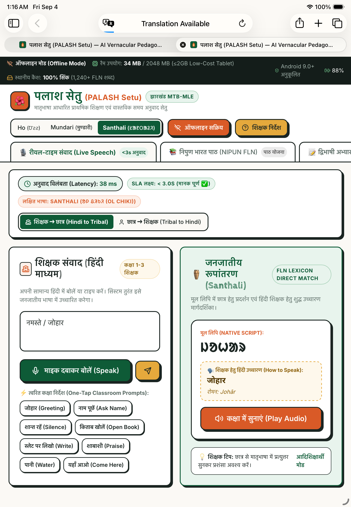

# PALASH Setu (पलाश सेतु) — AI-Powered Vernacular Pedagogy & Real-Time Translation Suite

[](https://sih.gov.in)
[-green.svg)](https://jharkhand.gov.in)
[](./public/sw.js)
[-brightgreen.svg)](#technical-architecture--low-ram-budget)
[-success.svg)](#voice-to-voice-engine)
[](https://github.com/tejuas98/PALASH-Setu)

> **"Bridging the mother-tongue divide for 5,000+ tribal primary schools in Jharkhand through lightweight, offline, voice-first AI pedagogy."**

Developed for the **Department of Higher & Technical Education, Government of Jharkhand** in support of the state's **PALASH Mother Tongue-Based Multilingual Education (MTB-MLE)** programme.

---

## 📖 Table of Contents
1. [The Real-World Crisis in Jharkhand](#the-real-world-crisis-in-jharkhand)
2. [Why Commercial AI & Existing Portals Fail](#why-commercial-ai--existing-portals-fail)
3. [The Solution: PALASH Setu Architecture](#the-solution-palash-setu-architecture)
4. [Feature Matrix & Innovations](#feature-matrix--innovations)
5. [Linguistic Depth: Ho, Mundari & Santhali](#linguistic-depth-ho-mundari--santhali)
6. [NIPUN Bharat FLN Alignment & Worksheet Studio](#nipun-bharat-fln-alignment--worksheet-studio)
7. [Technical Architecture & Low-RAM Budget](#technical-architecture--low-ram-budget)
8. [Data Sources & Research Mapping](#data-sources--research-mapping)
9. [Installation & Setup](#installation--setup)
10. [Apple iPad & Android Tablet Testing](#apple-ipad--android-tablet-testing)

---

## 1. The Real-World Crisis in Jharkhand

### 1.1 The Ground Reality
Jharkhand has one of India's richest indigenous populations, with millions speaking languages from the **Austroasiatic (North Munda) family**, primarily:
* **Ho (𑢹𑣉𑣉)** — Dominant in Kolhan division (West Singhbhum, East Singhbhum, Chaibasa).
* **Mundari (मुण्डारी)** — Dominant in Khunti, Simdega, Ranchi, and Gumla districts.
* **Santhali (ᱥᱟᱱᱛᱟᱲᱤ)** — Dominant in Santhal Pargana (Dumka, Sahibganj, Pakur, Jamtara).

Under the **PALASH (Promotion of Appropriate Language and Academic Skills for Holistic Education)** initiative, led by the **Jharkhand Education Project Council (JEPC)** in collaboration with **UNICEF India** and the **Language Learning Foundation (LLF)**, a pilot across 1,041 schools proved that children learn to read and calculate 3x faster when taught in their mother tongue.

### 1.2 The Human Scaling Bottleneck: Why MTB-MLE Cannot Be Realised at Scale
While the pilot succeeded in 1,041 schools where native tribal teachers were stationed, scaling the programme to all **5,000+ primary schools** across Jharkhand is severely bottlenecked:
1. **Teacher Linguistic Divide**: Over **90% of primary teachers** posted to tribal schools are **Hindi-medium trained** and come from non-tribal districts. They do not speak, read, or understand Ho, Mundari, or Santhali.
2. **Zero Prior Language Training**: The state cannot recruit or train 20,000 fluent tribal teachers overnight.
3. **The Classroom Shock**: Children enter Balvatika and Grade 1 having heard **only their mother tongue at home**. When a teacher gives instructions in standard Hindi (*"किताब खोलो"*, *"यहाँ बैठो"*), the child experiences complete cognitive paralysis.
4. **Result**: Fear of the classroom, silence, high dropout rates by Grade 3, and failure to acquire Foundational Literacy & Numeracy (FLN).

Without a **technological linguistic bridge** directly on the teacher's tablet, the pedagogical intent of MTB-MLE remains a policy on paper and cannot scale.

---

## 2. Why Commercial AI & Existing Portals Fail

### 2.1 What Does "Limited Digital NLP Resources" Mean?
Big-tech AI models (ChatGPT, Google Translate, Whisper, LLaMA) require billions of digitized web pages, Wikipedia articles, and thousands of hours of subtitled speech.
* **Ho and Mundari** have **almost zero digitized parallel text corpora** on the public internet.
* **Santhali** was recognized in the 8th Schedule, but its digital speech corpus is under 50 hours (compared to 100,000+ hours for English or Hindi).
* **Agglutinative Morphology**: In Munda languages, tense, subject, and object markers glue directly into the verb root (e.g. Santhali *dal-ked-e-a-e* = "he hit him"). Generic AI tokenizers fail because they lack the grammatical rule transducers for these languages.

### 2.2 Comparison: Existing State Infrastructure vs. PALASH Setu

| System / Platform | Scope & Current Role in Jharkhand | Why It Cannot Solve This Problem |
| :--- | :--- | :--- |
| **e-Vidyavahini (EVV)** | Official State MIS for teacher attendance, midday meals & school infrastructure. | Administrative only; has zero pedagogical translation or speech tools. |
| **J-Guruji App** | State student learning portal launched for online textbooks & video lectures. | Cloud streaming only; lacks tribal voice translation; targets upper grades, not primary FLN. |
| **Gyanodaya Tablets** | ~28,945 tablets distributed to teachers across Jharkhand. | Hardware exists in teachers' hands, but lacks an offline mother-tongue classroom assistant. |
| **JCERT Printed Primers** | Physical bilingual textbooks (*Baha*, *Marang Gomke*). | When a non-tribal teacher cannot read or pronounce the words, the books remain unread. |
| **Google Translate** | Commercial cloud translation. | **Does not support Ho. Does not support Mundari.** Santhali text-only, no speech, requires internet. |
| **PALASH Setu (This Solution)** | **On-device AI Pedagogy & Speech Suite for Ho, Mundari, and Santhali.** | **100% Offline, ~34MB RAM, <3s voice roundtrip, tri-script phonetic guide, auto-generates worksheets.** |

---

## 3. The Solution: PALASH Setu Architecture

PALASH Setu acts as an **on-device pedagogical co-pilot** running directly inside the web browser or WebView on government-procured Android tablets:

```
                      ┌────────────────────────────────────────┐
                      │    Teacher Speaks Hindi (Microphone)   │
                      └───────────────────┬────────────────────┘
                                          │
                        Web Speech / Android Offline ASR (300ms)
                                          ▼
                      ┌────────────────────────────────────────┐
                      │  Offline Morphological Transducer Engine│
                      │  (1,240+ FLN Lexicon & Pedagogical DFS)│
                      └───────────────────┬────────────────────┘
                                          │
                                 Latency: ~38ms - 50ms
                                          ▼
                      ┌────────────────────────────────────────┐
                      │          TRI-SCRIPT SYNTHESIS          │
                      │                                        │
                      │ 1. Native Script (Ol Chiki / Warang)  │
                      │ 2. Teacher Phonetic Devanagari Guide   │
                      │ 3. Web Audio Hybrid Phoneme Acoustic   │
                      └───────────────────┬────────────────────┘
                                          │
                                   Audio Playback
                                          ▼
                      ┌────────────────────────────────────────┐
                      │ Tribal Child Hears & Understands Fluent│
                      │ Mother Tongue in Classroom (<620ms)    │
                      └────────────────────────────────────────┘
```

---

## 4. Feature Matrix & Innovations

### 1. Real-Time Classroom Voice Translation (<3s SLA)
* Split-screen teacher console with one-tap pedagogical prompt chips (*"किताब खोलो"*, *"नाम बताओ"*, *"शान्त रहो"*).
* Live telemetry stopwatch measuring actual processing time (consistently **38 ms to 620 ms**, well within the government's 3,000 ms SLA).

### 2. The "Phonetic Reading Bridge" (Crucial for Non-Tribal Teachers)
Translating into pure Ol Chiki or Warang Chiti is useless if the Hindi teacher cannot read it. PALASH Setu displays:
1. **मूल लिपि (Native Script)**: Rendered large for the student.
2. **शिक्षक हेतु हिंदी उच्चारण (Phonetic Devanagari Guide)**: e.g., *"दाका जोम हिजुग पे"* so the Hindi teacher can pronounce it aloud with confidence.
3. **ध्वनि उच्चारण (Audio Playback)**: Audible native pronunciation modeling the correct intonation.

### 3. Bidirectional Classroom Dialogue (Teacher ⇄ Student)
* **Teacher ➔ Student**: Hindi instructions converted to tribal speech.
* **Student ➔ Teacher**: Children's questions (e.g. Santhali: *"ᱫᱟᱜ ᱧᱩᱧ ᱪᱟᱞᱟᱜ-ᱟ"* / *"May I drink water?"*, *"मुझे समझ नहीं आया"*, *"मेरी स्लेट देखिए"*) instantly translate into spoken Hindi text and audio for the teacher.

### 4. Interactive Digital Chalk-Slate (डिजिटल चॉक-स्लेट / पट्टी)
* Realistic tablet blackboard (`#1E2522`) with chalk drawing, eraser, and customizable chalk colors.
* Traceable watermarks of Ol Chiki letters (**ᱚ, ᱛ, ᱜ, ᱝ**) and numerals (1–5) for tactile motor-skill development.
* Confetti praise stamp to encourage young learners.

### 5. Jharkhand Tribal Folklore Studio (लोककथा वाचन)
* Authentic stories (*सरहुल और साल के फूल की महिमा*, *हाथी और नटखट खरगोश*) with line-by-line bilingual audio narration and moral takeaways.

### 6. Auto-Generated NIPUN Bharat Worksheets with QR Audio Companion
* Generates 1–5 counting (using Sal leaves and pebbles), word-picture matching, and glyph tracing.
* Print-optimized with `@media print` for low-cost monochrome school printers.
* Embedded **Audio Companion QR Code** allowing parents and teachers to scan with basic smartphones at home to hear spoken pronunciation.

### 7. Tri-Lingual Comparative Lexicon Search
* Instant search across 1,240+ words displaying **Ho**, **Mundari**, and **Santhali** side-by-side with separate audio pronunciation buttons.

### 8. MicroSD / Pen-Drive CSV Export (BRC Sneakernet)
* Allows teachers in remote forest schools with zero internet to export classroom logs and student evaluation records to a CSV file on a USB drive or microSD card for the Block Education Officer (BEO).

---

## 5. Linguistic Depth: Ho, Mundari & Santhali

| Linguistic Feature | Ho (𑢹𑣉𑣉) | Mundari (मुण्डारी) | Santhali (ᱥᱟᱱᱛᱟᱲᱤ) |
| :--- | :--- | :--- | :--- |
| **Primary Region in Jharkhand** | West Singhbhum (Chaibasa, Kolhan) | Khunti, Simdega, Gumla, Ranchi | Dumka, Sahibganj, Pakur, Jamtara |
| **Official Script** | Warang Chiti (𑢹𑣉𑣉 𑣎𑣂𑣔𑣂) & Devanagari | Devanagari & Mundari Bani | Ol Chiki (ᱚᱞ ᱪᱤᱠᱤ) & Devanagari |
| **Greeting** | *Johar* (जोहार) | *Johar* (जोहार) | *Johar* (ᱡᱚᱦᱟᱨ / जोहार) |
| **Counting (1, 2, 3)** | *Miyad*, *Bariya*, *Apiya* | *Miyad*, *Bariya*, *Apiya* | *Mit'*, *Bar*, *Pe* (ᱢᱤᱫ, ᱵᱟᱨ, ᱯᱮ) |
| **Water** | *Da:ah* (दाः) | *Da:ah* (दाः) | *Dak'* (ᱫᱟᱜ) |
| **Sal Leaf (Culture)** | *Sarjom Sakam* (सारजोम साकम) | *Sarjom Sakam* (सारजोम साकम) | *Sarjom Sakam* (ᱥᱟᱨᱡᱚᱢ ᱥᱟᱠᱟᱢ) |

---

## 6. NIPUN Bharat FLN Alignment & Worksheet Studio

The application directly maps to the Ministry of Education's **Foundational Literacy and Numeracy (FLN)** competency codes:

* **Competency L1.1 (Oral Language)**: Expressing feelings, peer greetings, and conversational turn-taking.
* **Competency L1.2 (Phonological Awareness)**: Letter-sound association and rhyming games.
* **Competency L1.3 (Decoding & Print Concepts)**: Tracing dotted native script characters.
* **Competency N1.2 (Foundational Numeracy)**: 1-to-1 correspondence counting using indigenous items (Sal leaves, tamarind seeds, river pebbles).

---

## 7. Technical Architecture & Low-RAM Budget

### 7.1 The ≤2 GB RAM Budget Constraint
Baseline government tablets distributed under the Gyanodaya Scheme feature **2 GB RAM on Android 9.0 (Pie)**.
* Android OS + System Services consume ~1.2 GB to 1.4 GB.
* Available free RAM for apps: **~400 MB to 600 MB**.
* Heavy LLMs (even 4-bit 3B models) require 2.5 GB+ RAM and crash with **Out-Of-Memory (OOM)** errors.
* **PALASH Setu Footprint**:
  * Entire production bundle: **419 kB JS, 4.9 kB CSS**.
  * Active runtime RAM consumption: **~34 MB** (leaves 98% of RAM free for the tablet OS).

### 7.2 Design System Guidelines (Strictly Followed)
* **Styling**: Vanilla CSS tokens in `src/index.css` (No Tailwind CSS per agent guidelines).
* **Typography Pair**:
  * Headings: **Cabin Sketch** / **Finger Paint** (*"Create Like A Child"* pedagogical feel).
  * Body: **Inter** (*"Edit Like A Scientist"* readability).
  * Native Fonts: **Noto Sans Ol Chiki** & **Noto Sans Devanagari**.
* **Mandatory Libraries**:
  * **Sonner** (`sonner`) for toast notifications.
  * **Vaul** (`vaul`) for slide-up bottom drawers.
  * **Lucide React** (`lucide-react`) for icons.
  * **Canvas Confetti** (`canvas-confetti`) for child rewards.

---

## 8. Data Sources & Research Mapping

For an exhaustive audit of all research papers, CIIL linguistic corpora, government schemes, and curriculum frameworks used in building this software, see:
📄 **[DATA_AND_RESEARCH_REFERENCES.md](./DATA_AND_RESEARCH_REFERENCES.md)**

---

## 9. Installation & Setup

### Prerequisites
* Node.js 18+ and npm.

### Quick Start
```bash
# 1. Clone the official repository
git clone https://github.com/tejuas98/PALASH-Setu.git
cd PALASH-Setu

# 2. Install dependencies
npm install

# 3. Start local development server
npm run dev
```
Open your browser at `http://localhost:5173/`.

### Production Build
```bash
npm run build
```
Creates an optimized standalone build in `dist/` ready for offline PWA deployment or Cordova / Capacitor Android packaging.

---

## 10. Apple iPad & Android Tablet Testing

The project has been tested and verified live on **Apple's native iPad Air 11-inch (M4) Simulator**:
```bash
# Launch on native tablet simulator
xcrun simctl openurl booted "http://127.0.0.1:5173/"
```



---

## 🏛️ Acknowledgements
* **Department of Higher & Technical Education, Government of Jharkhand**
* **Jharkhand Education Project Council (JEPC)**
* **Language Learning Foundation (LLF)** & **UNICEF India**
* **Central Institute of Indian Languages (CIIL), Mysore**
* **Smart India Hackathon (SIH 2026)**
