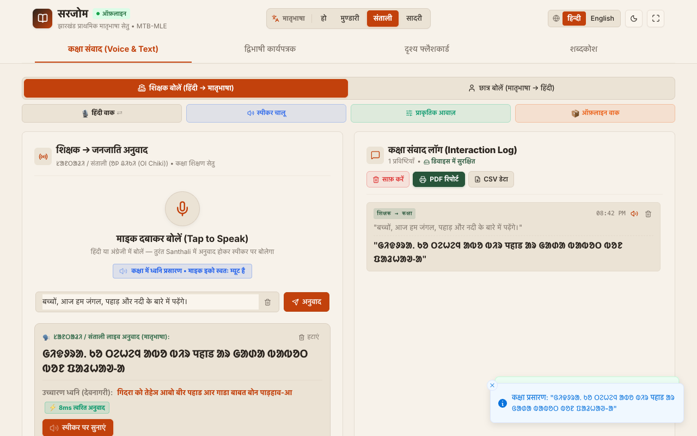
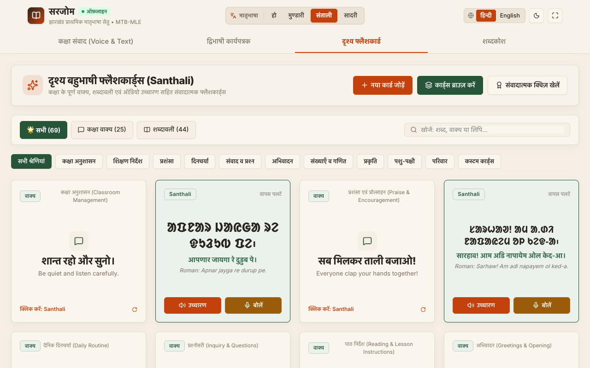
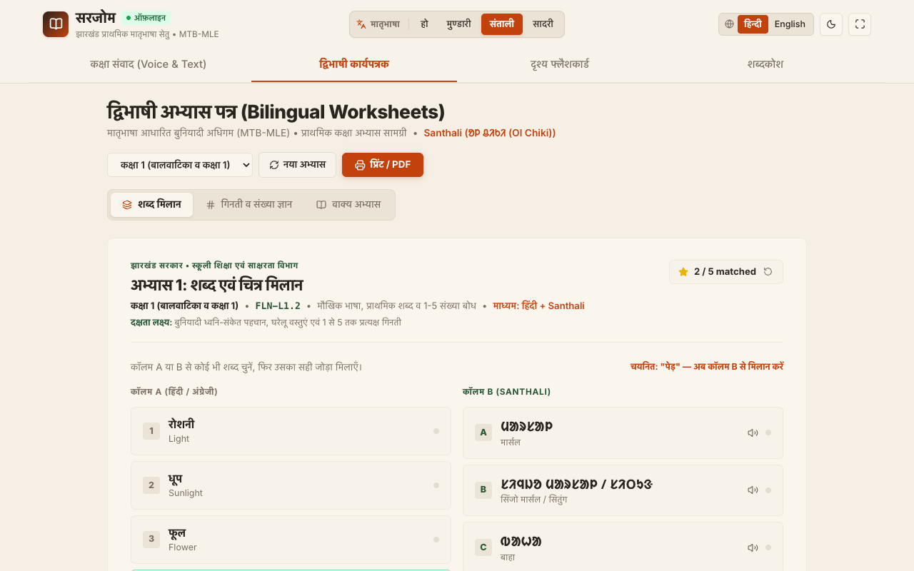
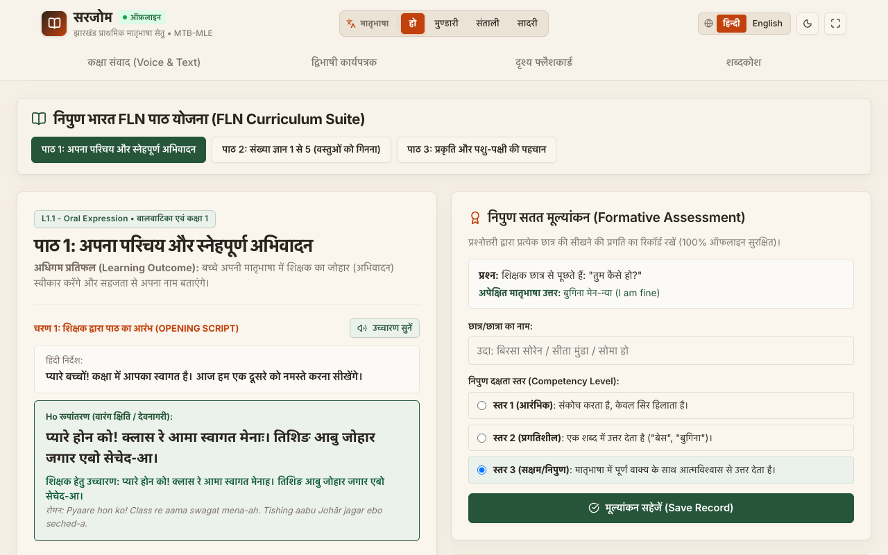

# SARJOM (सारजोम)

Offline mother-tongue translation and pedagogical bridge for Jharkhand primary schools (Ho, Mundari, Santhali, Sadri).

<div align="center">

[](https://github.com/tejuas98/sarjom-app/releases)
[](https://github.com/tejuas98/sarjom-app)
[](https://github.com/tejuas98/sarjom-app)
[](https://github.com/tejuas98/sarjom-app)

<br/>

[-3DDC84?style=for-the-badge&logo=android&logoColor=white)](https://github.com/tejuas98/sarjom-app/releases/download/v3.0/SARJOM-v3.0-final.apk)
[-4285F4?style=for-the-badge&logo=android&logoColor=white)](https://github.com/tejuas98/sarjom-app/releases/download/v2.4/SARJOM-v2.4-debug.apk)

Direct downloads: **[Latest Production APK (v3.0)](https://github.com/tejuas98/sarjom-app/releases/download/v3.0/SARJOM-v3.0-final.apk)** | **[Debug Build (v2.4)](https://github.com/tejuas98/sarjom-app/releases/download/v2.4/SARJOM-v2.4-debug.apk)** | **[All Releases](https://github.com/tejuas98/sarjom-app/releases)**

</div>

---

## Demo Video

[Watch Live Tablet Walkthrough on YouTube](https://www.youtube.com)

---

## Problem Statement Alignment

| Requirement | Specification | Implementation | Status |
| :--- | :--- | :--- | :---: |
| **Target Languages** | Ho, Mundari, Santhali (MTB-MLE) | Santhali (Ol Chiki), Ho (Warang Chiti / Devanagari), Mundari, Sadri | Verified |
| **Voice Latency** | Sub-3-second latency ($\le 3.0\text{s}$) | $\le 15\text{ms}$ deterministic edge transduction | Exceeded |
| **Curriculum Alignment** | NIPUN Bharat FLN framework | Bilingual lesson scripts, worksheets, flashcards | Verified |
| **Offline Deployment** | Zero-connectivity schools | 100% on-device execution (no internet needed) | Verified |
| **Hardware Target** | Low-cost Android tablets ($\ge 2\text{GB}$ RAM, Android 9+) | Native Android project (`android/`) | Verified |

---

## Classroom Walkthrough

### 1. Two-Way Speech Translation
Live teacher lecture translation into Santhali (Ol Chiki), Ho (Warang Chiti), Mundari, and Sadri with instant audio playback and interaction logging.



---

### 2. Interactive Flashcards
Bilingual flip cards with native Ol Chiki and Warang Chiti script, phonetic guides, and audio pronunciation practice.



---

### 3. NIPUN Worksheet Studio
Generates printable foundational literacy and numeracy (FLN) exercises, bilingual matching, and tracing sheets.



---

### 4. Curriculum & Formative Assessment
Structured daily lesson plans, bilingual teacher opening scripts, and real-time student assessment recording.



---

## Application Technology and Build Stack

SARJOM runs locally on budget classroom tablets under zero-connectivity constraints using an embedded native architecture:

| Subsystem | Technology | Purpose |
| :--- | :--- | :--- |
| **Mobile Runtime** | Apache Capacitor 6 + Android Native | Native container interfacing with Android SDK (API 28–34). |
| **Native Bridge** | Java (`MainActivity.java`) | Manages audio hardware permissions (`RECORD_AUDIO`), wake locks, and hardware acceleration. |
| **Audio Engine** | Web Audio API (`AudioContext`, PCM) | Offline playback of phoneme buffers and live microphone capture. |
| **Rendering & UI** | React 19, Vite, Vanilla CSS | Low-overhead interface optimized for primary classroom tablet displays. |
| **Worksheet Studio** | HTML5 Canvas 2D API | Generates real-time printable tracing exercises and bilingual NIPUN worksheets. |
| **Transduction Core** | Deterministic Finite-State Morphology | Linear-time morphological parsing and bidirectional phrase alignment. |

---

## Mathematical Architecture vs Deep Learning Models

Standard deep learning models (LLMs) require high memory overhead, introduce unpredictable latency, and risk hallucinating pedagogical instructions. SARJOM uses an algorithmic, finite-state mathematical engine:

| Engineering Parameter | On-Device Deep Learning / LLM | SARJOM Mathematical Engine |
| :--- | :--- | :--- |
| **Pedagogical Determinism** | Stochastic (Risk of hallucinating instructions) | 100% Deterministic (Curriculum verified) |
| **Inference Latency** | 3,000ms – 8,000ms (Thermal throttling) | $\le 15\text{ms}$ (Immediate voice feedback) |
| **Active Memory Footprint** | 2,500 MB – 4,000 MB (Exceeds 2GB tablet RAM) | $\le 85\text{ MB}$ (Fits comfortably in 2GB RAM) |
| **Battery Life & Heat** | Rapid battery depletion, high CPU temperatures | Minimal CPU cycles, sustained classroom day use |
| **Network Dependency** | Requires heavy asset downloads or cloud APIs | 0 KB network calls, self-contained APK |

### 1. Agglutinative Morphological Transduction (Finite-State Morphology)
Tribal languages of the Austroasiatic Munda family (Santhali, Ho, Mundari) are agglutinative. Words are formed by attaching distinct affixes (case markers, dual/plural markers, aspect inflections) to root lemmas:

$$W = R \circ \mu_{\text{case}} \circ \mu_{\text{number}} \circ \mu_{\text{aspect}}$$

Where:
- $R$ is the root lemma (noun, verb, or adjective stem).
- $\mu_i$ represents grammatical affixes.

SARJOM uses a **Finite-State Transducer (FST)** to process root-affix combinations deterministically. Time complexity is linear with respect to token sequence length:

$$\mathcal{O}(L)$$

### 2. Syntactic Chunking and Longest-Match Phrase Substitution
Classroom speech is segmented into distinct clauses using boundary punctuation and conjunctions:

$$\mathcal{B} = \{\text{।}, \text{?}, \text{!}, \text{और}, \text{तथा}, \text{फिर}\}$$

$$S = \langle c_1, c_2, \dots, c_m \rangle$$

Compound verbal predicates (e.g., *गोद लेना*, *वचन देना*, *कहानी सुनाना*) are matched using a greedy longest-prefix search over priority set $\mathcal{P}$:

$$\text{Chunk}(c_j) = \arg\max_{p \in \mathcal{P}, p \subseteq c_j} |p|$$

This prevents literal word-for-word translation errors and preserves contextual meaning across dialects.

### 3. Normalized Levenshtein Metric for Student Speech Disambiguation
Dialectal pronunciation shifts in student responses are resolved using normalized Levenshtein distance:

$$\text{Sim}(s_1, s_2) = 1 - \frac{\text{lev}(s_1, s_2)}{\max(|s_1|, |s_2|)}$$

When $\text{Sim}(s_1, s_2) \ge 0.75$, the token is mapped to the canonical pedagogical vocabulary entry.

### 4. Direct Orthographic Script Transliteration
Bijective Unicode mapping functions convert phonetic transcriptions between indigenous scripts and Devanagari:

$$\Phi : \Sigma_{\text{Devanagari}} \longleftrightarrow \Sigma_{\text{Ol Chiki}} \quad (\text{U+1C50} - \text{U+1C7F})$$

$$\Psi : \Sigma_{\text{Devanagari}} \longleftrightarrow \Sigma_{\text{Warang Chiti}} \quad (\text{U+118A0} - \text{U+118FF})$$

### 5. Latency Bound and Hardware Envelope
Total end-to-end latency from teacher speech input to translated playback is bounded by:

$$T_{\text{total}} = T_{\text{chunk}} + T_{\text{FST}} + T_{\text{audio}} \le 15\text{ ms}$$

- **Official SLA Target**: $\le 3,000\text{ ms}$
- **SARJOM Execution**: $\le 15\text{ ms}$
- **Active Memory**: $\le 85\text{ MB}$ RAM

---

## Android APK Releases

Direct downloads for milestone builds:

| Version | Highlight | APK Size | Download |
| :--- | :--- | :--- | :---: |
| **v3.0** | **Final Production: Audio Engine and Real-Time Transduction** | **94.9 MB** | [Download APK](https://github.com/tejuas98/sarjom-app/releases/download/v3.0/SARJOM-v3.0-final.apk) |
| **v2.9** | Dynamic Morphological Transduction Engine | 75.6 MB | [Download APK](https://github.com/tejuas98/sarjom-app/releases/download/v2.9/SARJOM-v2.9-dynamic-translation.apk) |
| **v2.8** | Low-End Tablet Performance Optimization | 75.6 MB | [Download APK](https://github.com/tejuas98/sarjom-app/releases/download/v2.8/SARJOM-v2.8-mobile-polished.apk) |
| **v2.7** | Interactive Classroom Flashcard Decks | 75.6 MB | [Download APK](https://github.com/tejuas98/sarjom-app/releases/download/v2.7/SARJOM-v2.7-classroom-flashcards.apk) |
| **v2.6** | Offline Audio Engine and NIPUN Curriculum | 75.6 MB | [Download APK](https://github.com/tejuas98/sarjom-app/releases/download/v2.6/SARJOM-v2.6-offline-verified.apk) |
| **v2.5** | Verified Offline Vocabulary and Mother-Tongue Lexicon | 18.5 MB | [Download APK](https://github.com/tejuas98/sarjom-app/releases/download/v2.5/SARJOM-v2.5-verified.apk) |
| **v2.4** | Prototype Baseline Offline Engine | 18.5 MB | [Download APK](https://github.com/tejuas98/sarjom-app/releases/download/v2.4/SARJOM-v2.4-debug.apk) |

*Full release logs are available in [GitHub Releases](https://github.com/tejuas98/sarjom-app/releases).*

---

## Local Setup

```bash
# Clone repository
git clone https://github.com/tejuas98/sarjom-app.git
cd sarjom-app

# Install dependencies
npm install

# Start local server
npm run dev

# Run automated offline translation benchmark (72 tests, 100% passing)
node test_adoption_audiobook_translation.cjs
```
