# SARJOM — Native App Architecture & Tech Stack
> **SIH 2026 · Problem SIH26042 · Team Karasuno**
> Status: **Planning** — Current codebase is PWA/Capacitor. This doc defines the React Native migration target.

---

## Current PWA vs. React Native Target

| | Current (PWA/Capacitor) | Target (React Native) |
|---|---|---|
| Runtime | Chrome WebView on Android | Native Android process |
| ASR | `@capacitor-community/speech-recognition` | `@react-native-voice/voice` |
| TTS | `window.SpeechSynthesis` API | `react-native-tts` (Android `TextToSpeech`) |
| Audio | `<audio>` HTML element | `react-native-sound` |
| Storage | `localStorage` (browser API) | `react-native-mmkv` (native KV store) |
| UI | HTML/CSS in WebView | Native Views via React Native |
| Build | Vite + Capacitor Gradle | Metro + Gradle |
| PDF | puppeteer-core (Node.js script) | `react-native-html-to-pdf` |
| Camera/ORF | Web Audio API (browser) | `react-native-camera` |
| RAM overhead | ~120 MB (WebView) | ~45 MB (no WebView) |
| Startup | ~3.5 s (WebView init) | ~1.2 s (native) |
| Offline claim | Partial — ASR was Chrome cloud | True 100% offline |

---

## Corrected Tech Stack (React Native Native App)

```
CORE FRAMEWORK
  React Native (bare workflow)  ·  Metro Bundler  ·  Gradle APK

SPEECH & AUDIO — 100% Offline
  ASR   → @react-native-voice/voice
            Android SpeechRecognizer · preferOffline:true · hi-IN
  TTS   → react-native-tts
            Android TextToSpeech engine · on-device · no cloud
  Audio → react-native-sound
            Pre-bundled .mp3 clips in APK assets · tribal studio audio
  Mic   → react-native-camera (for ORF pronunciation scoring)

NLP & TRANSLATION — 100% Offline
  On-Device Cascade NLP Engine (React Native JS thread):
    1. Lexicon lookup         (tribalLexicon.js · 4 languages)
    2. Morphological roots    (Hoffmann/Bodding/Deeney corpus)
    3. Cosine similarity      (semantic matcher)
    4. Neural fallback        (customNeuralMundaEngine.js · 14.8 MB · INT8)
  Languages: Ho · Mundari · Santhali · Sadri <-> Hindi / English

SCRIPT & PHONETICS — 100% Offline
  Ol Chiki (U+1C50–U+1C7F)
  Warang Chiti (U+118A0–U+118FF)
  Devanagari + Roman phonetic transliteration
  Custom Unicode font bundled in APK assets (no Google Fonts CDN)

STORAGE & OFFLINE — 100% Offline
  react-native-mmkv              → fast native KV (replaces localStorage)
  react-native-sqlite-storage    → lexicon index + MIS assessments
  APK bundled assets             → lexicon JSON, audio clips, font files
  No CacheStorage · No Service Worker · No IndexedDB · No cloud sync

WORKSHEET & PDF — 100% Offline
  react-native-html-to-pdf       → A4 worksheet PDF generation
  react-native-qrcode-svg        → QR codes generated locally (no API)
  QR payload: base64-encoded audio URI (self-contained · no server)

PEDAGOGY & STANDARDS
  NIPUN Bharat FLN (80:20 MTB-MLE)  ·  NEP 2020  ·  UDISE+
  Hoffmann 1903 · Bodding 1929 · Deeney 1975 · Nowrangi lexicons

ML RESEARCH PIPELINE — offline training, NOT shipped in APK
  PyTorch Transformer → LoRA PEFT fine-tune → ONNX INT8 export
  Produces: customNeuralMundaEngine.js weight arrays → bundled via Metro

BUILD & TOOLING
  Metro Bundler · Gradle · Node.js · Android Studio
  Target: Android 9+ (API 28+) · Gyanodaya Tablet · ≤2 GB RAM
```

---

## Complete System Flowchart

```mermaid
flowchart TD
    ENTRY["📲 Teacher Opens SARJOM\nReact Native APK · Android 9+ · Gyanodaya Tablet\nNo internet · No server · No cloud API"]

    ENTRY --> NAV{Teacher selects\nfeature}
    NAV -->|Voice| P1A
    NAV -->|Worksheets| P2A
    NAV -->|Flashcards| P3A
    NAV -->|Lexicon| P4A

    %% ── PILLAR 1: VOICE BRIDGE ──────────────────────────────────────────
    subgraph VOICE ["🎙️ PILLAR 1 — Real-Time Voice Bridge  Teacher ⇄ Student"]
        direction TB
        P1A["🎤 Hindi Teacher Speaks\nreact-native-camera mic · noise gate"]
        P1B["🤖 Android On-Device SpeechRecognizer\n@react-native-voice/voice\npreferOffline:true · hi-IN · 100% offline"]
        P1C["⌨️ Typed-Input Fallback\nIf Android offline ASR pack missing"]
        P1D["🧠 On-Device Cascade NLP Engine\n1. Lexicon lookup\n2. Morphological root match\n3. Cosine similarity\n4. Neural fallback — customNeuralMundaEngine.js · 14.8 MB"]
        P1E["🔊 react-native-tts\nAndroid TextToSpeech · on-device\nBluetooth A2DP speaker broadcast"]
        P1F["🎵 Pre-bundled Audio Clips\nreact-native-sound · .mp3 in APK assets"]
        P1G["👂 Student Speaks → Reverse Mode\nMother-tongue → Android ASR → Hindi text for teacher\n3 one-tap response chips"]
        P1Z(["✅ Class hears tribal audio\nDual-script: Hindi + Ol Chiki / Warang Chiti\nTotal < 1.75 s · 100% offline"])

        P1A --> P1B
        P1B -->|result| P1D
        P1B -->|offline pack missing| P1C
        P1C --> P1D
        P1D --> P1E
        P1E --> P1F
        P1F --> P1G
        P1G --> P1Z
    end

    %% ── PILLAR 2: WORKSHEETS ────────────────────────────────────────────
    subgraph WORKSHEETS ["📄 PILLAR 2 — Bilingual FLN Worksheet Generator"]
        direction TB
        P2A["📋 Teacher Selects Params\nGrade Balvatika–Class 3 · FLN-L1/L2\nDialect: Ho / Mundari / Santhali / Sadri"]
        P2B["🧠 On-Device NLP Word-Pair Generator\ncustomNeuralMundaEngine.js · INT8 weights\nNIPUN Bharat FLN vocab · no cloud"]
        P2C["🗂️ 3 Worksheet Types\nWord-Picture Matching\nNumeracy 1-10\nSentence Fill-Blanks"]
        P2D["🖼️ Dual-Script Renderer\nDevanagari + Ol Chiki U+1C50 + Warang Chiti U+118A0\nBundled font from APK assets — no CDN"]
        P2E["📱 Interactive On-Screen Mode\nNative React Native Views · tap-to-match\nScore in react-native-mmkv · offline"]
        P2F["🖨️ react-native-html-to-pdf\nA4 PDF · block printer / photocopy\n1 tablet → 35 students"]
        P2G["📲 react-native-qrcode-svg\nQR payload = base64 audio URI\nSelf-contained · no server · no URL"]
        P2Z(["✅ Take-home bilingual worksheet\nParent scans QR → audio plays offline on any Android\nNo internet · no page · no server"])

        P2A --> P2B
        P2B --> P2C
        P2C --> P2D
        P2D --> P2E
        P2D --> P2F
        P2F --> P2G
        P2G --> P2Z
    end

    %% ── PILLAR 3: FLASHCARDS ────────────────────────────────────────────
    subgraph FLASHCARDS ["🃏 PILLAR 3 — Visual Multilingual Flashcard Deck"]
        direction TB
        P3A["🗂️ Select Category\nGreetings · Nature · Animals · Body Parts\nNumbers · Colours"]
        P3B["📦 4-Language Tribal Lexicon\ntribalLexicon.js · bundled in APK\nHo / Mundari / Santhali / Sadri ↔ Hindi\n8500+ word pairs · cosine lookup"]
        P3C["🎴 Native Flashcard Flip\nReact Native Animated API · 3D perspective\nFront: Hindi + image\nBack: Native script + Roman phonetic"]
        P3D["🔊 react-native-tts + react-native-sound\nOn-device TTS + pre-bundled clips\n< 50 ms · no internet"]
        P3E["🧩 NIPUN Oral Quiz Mode\n4-choice MCQ · score tracking\nreact-native-mmkv · FLN-L2 aligned"]
        P3F["📊 AI ORF Pronunciation Coach\nreact-native-camera mic\nDSP formant distance · accuracy score"]
        P3Z(["✅ Student vocabulary mastery\nOl Chiki + Warang Chiti + Roman phonetic\n100% offline · heritage scripts preserved"])

        P3A --> P3B
        P3B --> P3C
        P3C --> P3D
        P3D --> P3E
        P3E --> P3F
        P3F --> P3Z
    end

    %% ── PILLAR 4: LEXICON + FOLKLORE + MIS ─────────────────────────────
    subgraph LEXICON ["📖 PILLAR 4 — Dual-Script Lexicon · Folklore · MIS Export"]
        direction TB
        P4A["🔍 Search Word\nHindi / English / romanised tribal phonetics\nFuzzy match · SQLite FTS5 · < 20 ms"]
        P4B["🧠 Cosine Similarity Semantic Lookup\nOffline SQLite vector index · 4-language\nno API call"]
        P4C["📜 Dual-Script Entry Rendered\nOl Chiki U+1C50 + Warang Chiti U+118A0\n+ Devanagari · bundled font"]
        P4D["🔊 Native Audio Playback\nreact-native-sound · bundled speaker clips\nWord + sentence + classroom example"]
        P4E["📖 Cultural Folklore Storyteller\nSarhul · Karam · Saranda stories\nSynchronized bilingual · react-native-tts"]
        P4F["📤 MIS Export · BRC Handover\nSQLite → CSV · UDISE+ linked\ne-Vidyavahini 2.0 format\nMonthly Sneakernet USB sync — no internet"]
        P4Z(["✅ Indigenous heritage preserved\nHo + Mundari + Santhali + Sadri\nNative scripts · not transliterated\nUNESCO endangered languages protected"])

        P4A --> P4B
        P4B --> P4C
        P4C --> P4D
        P4D --> P4E
        P4E --> P4F
        P4F --> P4Z
    end

    %% ── SHARED EDGE RUNTIME ─────────────────────────────────────────────
    subgraph EDGE ["⚡ Edge Runtime — All 4 Pillars share this layer  100% Offline"]
        direction LR
        E1["🤖 Android On-Device ASR\n@react-native-voice/voice\nSpeechRecognizer · preferOffline"]
        E2["🔊 Android On-Device TTS\nreact-native-tts\nTextToSpeech · no cloud"]
        E3["🧠 JS NLP Engine\ncustomNeuralMundaEngine.js\n14.8 MB · INT8 · Metro bundle"]
        E4["💾 react-native-mmkv\nNative KV store\nReplaces localStorage"]
        E5["🗄️ SQLite\nreact-native-sqlite-storage\nLexicon · MIS · Assessments"]
        E6["📁 APK Assets\nAudio clips · Unicode fonts\nLexicon JSON · bundled offline"]
    end

    %% ── ML RESEARCH PIPELINE ────────────────────────────────────────────
    subgraph ML ["🔬 ML Research Pipeline  offline training — NOT shipped in APK"]
        direction LR
        ML1["PyTorch Transformer\nHo/Mundari/Santhali corpus"] --> ML2["LoRA PEFT fine-tune\nlow-resource tribal NLP"]
        ML2 --> ML3["ONNX INT8 export\nweight quantisation"]
        ML3 --> ML4["customNeuralMundaEngine.js\n14.8 MB JS weight arrays\nbundled via Metro into APK"]
    end

    VOICE -.->|uses| EDGE
    WORKSHEETS -.->|uses| EDGE
    FLASHCARDS -.->|uses| EDGE
    LEXICON -.->|uses| EDGE
    ML4 -.->|weight arrays| E3

    style ENTRY fill:#1E40AF,color:#fff
    style VOICE fill:#EFF6FF,stroke:#1E40AF
    style WORKSHEETS fill:#F0FDF4,stroke:#166534
    style FLASHCARDS fill:#F5F3FF,stroke:#7C3AED
    style LEXICON fill:#FFF7ED,stroke:#B45309
    style EDGE fill:#0F172A,color:#60A5FA,stroke:#334155
    style ML fill:#1E1B4B,color:#A5B4FC,stroke:#6366F1
    style P1Z fill:#DCFCE7,stroke:#16A34A,color:#166534
    style P2Z fill:#DCFCE7,stroke:#16A34A,color:#166534
    style P3Z fill:#DCFCE7,stroke:#16A34A,color:#166534
    style P4Z fill:#DCFCE7,stroke:#16A34A,color:#166534
```



---

## Audit — Issues in `PROPOSED_SOLUTION.md` to Fix

### Web App / Browser mentions — WRONG for native app

| Line | Current Text | Problem | Fix |
|---|---|---|---|
| L137 | *"parents can scan it with any basic mobile phone"* | Implies QR opens a **web URL / page** | Change to: QR encodes base64 audio — plays via any QR scanner, no internet, no URL |
| L244 | *"Scanning the QR code opens a **lightweight page**"* | "lightweight page" = a web server — BREAKS offline claim | Fix: "QR contains self-contained audio — no page, no server, no internet" |
| L137 | *"Dynamic Audio QR Code"* | "Dynamic" = server-generated/hosted QR | Fix to: "Static self-contained QR (audio base64-encoded offline)" |

### Online / Cloud-dependent — WRONG for 100% offline claim

| Line | Current Text | Problem | Fix |
|---|---|---|---|
| L244 | QR → *"lightweight page"* | = server URL = needs internet to load | Critical fix: QR payload = `data:audio/mp3;base64,...` |

### Implied web/PWA on PPT slide

| Slide Element | Problem | Fix |
|---|---|---|
| "Speech recognition" box | No spec on-device vs cloud | Add: "Android on-device (offline)" |
| "Audio preprocessing" | Sounds cloud-like | Rename: "On-device noise gate (Android AudioRecord)" |
| No tech badge shown | Jury assumes web/browser | Add badge: "React Native · Android Native" |

---

## QR Code — Design Decision

Current PROPOSED_SOLUTION.md says QR opens a **"lightweight page"** — this is a web server and needs internet. It must be fixed.

**Option A — Self-Contained base64 QR (Recommended for SIH)**
```
QR payload = data:audio/mp3;base64,<encoded-audio>
Parent scans → any QR app decodes base64 → plays audio inline
No internet · No server · No URL · Works on any Android QR app
```

**Option B — SARJOM Companion APK**
```
QR payload = sarjom://play?word=johar&lang=santhali
Parent scans → Opens SARJOM Companion App (free APK via sideload)
APK contains all audio → plays offline
No internet · Slightly more setup · Richer experience
```

> For the PPT: use Option A — simpler, stronger "zero internet" story.

---

## React Native App Structure (Idea — No Code Yet)

```
SARJOM-native/
├── android/
│   └── app/src/main/
│       ├── assets/          ← audio .mp3, Unicode font files (bundled offline)
│       └── res/             ← icons, splash
├── src/
│   ├── screens/
│   │   ├── VoiceBridgeScreen.jsx    ← Pillar 1
│   │   ├── WorksheetScreen.jsx      ← Pillar 2
│   │   ├── FlashcardScreen.jsx      ← Pillar 3
│   │   └── LexiconScreen.jsx        ← Pillar 4
│   ├── services/
│   │   ├── asrService.js            ← @react-native-voice/voice wrapper
│   │   ├── ttsService.js            ← react-native-tts wrapper
│   │   ├── nlpEngine.js             ← customNeuralMundaEngine (migrated)
│   │   └── storageService.js        ← react-native-mmkv wrapper
│   ├── data/
│   │   ├── tribalLexicon.js         ← 4-language lexicon (same as current)
│   │   ├── nipunCurriculum.js       ← FLN lesson data (same as current)
│   │   └── folkStories.js           ← folklore data (same as current)
│   └── assets/
│       ├── audio/                   ← .mp3 tribal audio clips
│       └── fonts/                   ← Noto Sans Ol Chiki + tribal fonts
├── metro.config.js
└── android/build.gradle
```
