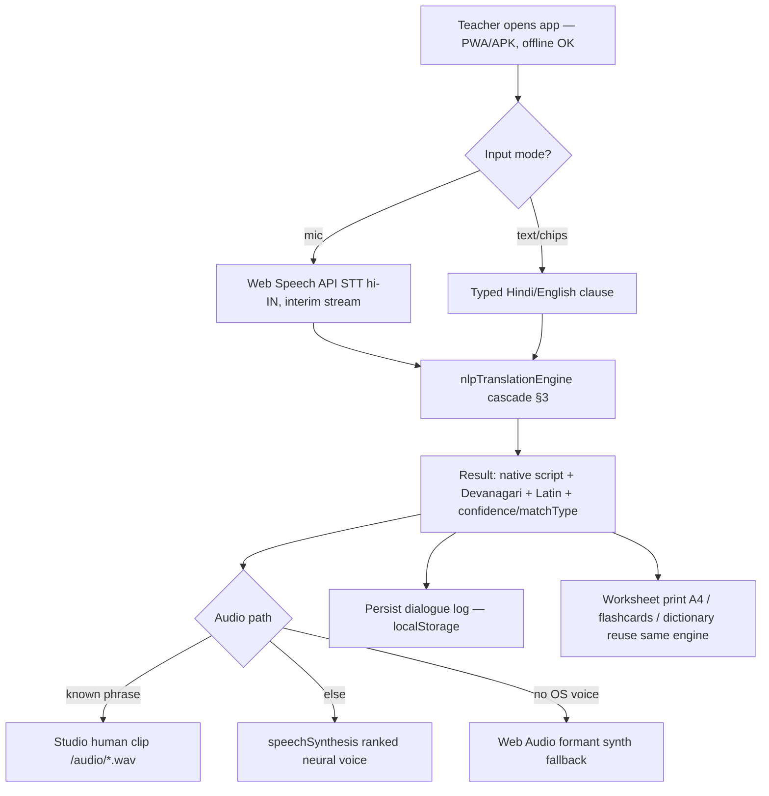

# SARJOM (सरजोम) / PALASH-Setu — Technical Approach Review

> Independent, code-verified review of the whole repository (`tejuas98/PALASH-Setu`, branch `arena/01a08152-palash-setu`).
> Covers: **(A) Technologies used**, **(B) Methodology & process for implementation** (flow charts, images, working prototype), plus an honest **claims-vs-code audit**.
> Every statement below was checked against the actual source, build output, test harness and APK in this checkout on 2026-09-08.

---

## 0. What the project is

| Field | Value |
| :--- | :--- |
| **Product** | SARJOM (सरजोम) — AI-assisted vernacular pedagogy & real-time voice translation suite for Mother-Tongue-Based Multilingual Education (MTB-MLE / "PALASH" programme) |
| **Origin** | Smart India Hackathon 2026 submission, Problem Statement **SIH26042**, client: Govt. of Jharkhand, Dept. of Higher & Technical Education |
| **Problem solved** | Hindi-medium teachers cannot teach tribal children whose mother tongues are **Ho, Mundari, Santhali** (+ Sadri/Nagpuri as 4th language); schools are offline; tablets are ≤ 2 GB RAM |
| **Core function** | Teacher speaks/types Hindi → instant tribal-language text (native script + Devanagari phonetics + Latin phonetics) + spoken audio; reverse "Student Ear" mode; NIPUN Bharat worksheets, flashcards, dictionary |
| **Form factor** | Offline-first **PWA** (React SPA) shipped three ways: Vercel web app, installable PWA, and a **Capacitor Android APK** (`SARJOM-v2.5-verified.apk`, `public/sarjom.apk`) |
| **Repo shape** | ~9.4 k LOC app source (`src/`), ~0.4 k LOC ML research scripts (`ml/`), 20+ whitepaper `.md` docs, HTML→PDF slide generators, Puppeteer capture/verify scripts, Node test harnesses, screenshots/GIF/MP4 evidence, prebuilt APK |

---

## 1. Technologies used

### 1.1 Programming languages

| Language | Where | Role |
| :--- | :--- | :--- |
| **JavaScript / JSX (ES2022+)** | `src/**` (~9.4 k LOC), root `*.cjs/*.js` harnesses | Entire application: UI, NLP engine, speech service, storage, service worker, tests, benchmarks, PDF/screenshot generators |
| **Python 3 + PyTorch** | `ml/palash_munda_transformer.py`, `ml/train_fine_tune_munda.py` | Research/training layer: custom seq2seq Transformer architecture, LoRA/PEFT fine-tune spec, ONNX INT8 quantization spec |
| **Java** | `android/app/src/main/java/org/jharkhand/sarjom/MainActivity.java` | Capacitor bridge activity; runtime `RECORD_AUDIO` permission; WebView media autoplay flag |
| **CSS3** | `src/index.css` (806 lines), `src/App.css` | Design system ("Parchment Sand"/OLED dark theme), `@media print` A4 worksheet engine, responsive tablet/mobile layouts |
| **HTML5** | `index.html`, slide decks | PWA shell with self-healing service-worker bootstrap; pitch/technical slide decks |
| **Gradle (Groovy)** | `android/*.gradle` | Android build (compileSdk from Capacitor variables, Java 17 target, debug signing config) |

### 1.2 Frameworks, libraries & tooling (from `package.json`, verified installed & building)

| Layer | Technology | Version | Purpose |
| :--- | :--- | :--- | :--- |
| UI framework | **React** (+ `react-dom`) | ^19.2.8 | Component tree: 4 core tabs (Voice Translator, Worksheet Studio, Flashcards, Dictionary), navbar, error boundary |
| Build tool | **Vite** (+ `@vitejs/plugin-react`) | ^8.2.2 | Dev server & production bundler; custom middleware for `.apk` MIME; `base: './'` for file-relative PWA/APK assets |
| Icons / UI kit | `lucide-react`, `sonner` (toasts), `vaul` (drawers), `canvas-confetti` | ^1.40 / ^2.0 / ^1.1 / ^1.9 | Iconography, feedback toasts, slide-up teacher drawer, reward animation |
| Mobile shell | **Capacitor** (`@capacitor/core`, `/android`, `/ios`, `/cli`) | ^8.5.1 | Wraps the same web bundle into a native Android APK / iOS app (`appId: org.jharkhand.sarjom`, `webDir: dist`) |
| Linter | **oxlint** | ^1.79.0 | `npm run lint` |
| Test/verification | **Node built-in test harnesses** (`run_hard_tests.js`, `benchmark_memory_and_latency.cjs`, `test_*.js`) + **puppeteer-core** | ^25.10.0 | Assertion suites, latency stress, headless-Chrome screenshot/video capture & UI verification scripts |
| Docs pipeline | Node PDF generators (`generate_*_pdf.cjs`) + HTML slide decks | — | Produces `TECHNICAL_APPROACH_SLIDE.pdf`, pitch PDFs from HTML |
| ML (optional deps, graceful-degradation) | PyTorch, HuggingFace `transformers`, `peft` (LoRA), `onnx`/`onnxruntime` | — | Training & quantization pipeline runs in "spec-export mode" when absent |
| Hosting | **Vercel** (`vercel.json`: SPA rewrites, SW no-cache headers, APK content-type) | — | Live prototype at `palash-setu.vercel.app` |

### 1.3 Browser / platform APIs that carry the real workload

| API | File | Use |
| :--- | :--- | :--- |
| **Web Speech API** (`webkitSpeechRecognition`) | `src/services/voiceTranslationService.js` | Real-time Hindi/English speech-to-text for the teacher mic (interim + final results, error taxonomy: not-allowed / network / audio-capture) |
| **SpeechSynthesis (TTS)** | same | Tribal-phonetic audio output with a ranked voice selector (hi-IN Natural/Enhanced/Neural → en-IN → any), rate/pitch control |
| **Web Audio API** | same | UI chimes (oscillator+gain), and an offline **formant voice synthesizer fallback** (sawtooth glottal source → F1≈620 Hz / F2≈1720 Hz band-pass filters → envelope) when no OS voice exists |
| **HTML5 `<audio>` studio bank** | `public/audio/*.wav/mp3/m4a` | Pre-recorded human native-speaker clips (self-intros in 4 languages, Johar greeting, lesson openings) played before any synthetic voice |
| **Service Worker + Cache Storage** | `public/sw.js`, bootstrap in `index.html` | Offline PWA: network-first for navigations, cache-first for assets, stale-cache purge & auto-recovery |
| **localStorage** | `src/services/offlineStorage.js`, `VoiceTranslator.jsx` | Offline persistence: language, UI language, offline flag, dialogue log, student assessments, custom lessons |
| **CSS `@media print`** | `src/index.css` | A4/300-DPI bilingual worksheet rendering (`window.print()`) |
| **Canvas 2D** | `SlateAndFolklore.jsx`, `AcousticPronunciationCoach.jsx` | Chalkboard slate drawing & waveform visualisation (components present in repo, currently unmounted — §5) |
| **Unicode Ol Chiki (U+1C50–1C7F) / Warang Chiti** | `voiceTranslationService.js` (`olChikiToDevanagari`), fonts in `index.html` (Noto Sans Ol Chiki) | Script transliteration & rendering |

### 1.4 Hardware / deployment targets

* **Primary:** low-cost Android tablets **≤ 2 GB RAM, Android 9+** (Gyanodaya-style), via Capacitor APK or installed PWA; landscape orientation, safe-area aware.
* **Secondary:** iPad (iOS 15+ Capacitor/iOS platform present), desktop Chromium for teacher prep/printing; parent smartphones consume printed **audio-QR** worksheets.
* **Peripherals assumed:** tablet mic + speaker (or classroom soundbar), optional xerox/printer.
* **Network model:** zero network in classroom after first cache; one-time sync at BRC/block office Wi-Fi (documented "sneakernet" MicroSD/CSV path for governance export).

---

## 2. System architecture (as implemented)

### 2.1 Three tiers

```
TIER 1 — Cloud / BRC (documented, optional at runtime)
   Bhashini/IndicTrans2 REST bridge (ml/bhashini_cloud_bridge.js — mock key, not wired into the app)
   PyTorch training & INT8-ONNX export specs (ml/*.py)
        │ one-time sync (documented)
TIER 2 — On-device edge engine (the real product)
   nlpTranslationEngine.js   : deterministic cascade translator (see §3)
   customNeuralMundaEngine.js: demo/inspector "neural runtime" (attention heatmap UI)
   offlineStorage.js         : localStorage persistence
   voiceTranslationService.js: STT / TTS / studio-audio / formant-synth chain
        │
TIER 3 — Presentation (React 19 SPA)
   4 tabs + navbar + themes (i18n EN/HI) + print engine + PWA shell
   Packaged as: Vercel web app │ installable PWA (sw.js) │ Capacitor Android APK
```

### 2.2 Input → Process → Output (repo diagram: `public/sarjom_ipo_pipeline.png|svg`)

* **INPUT:** teacher voice (Hindi) or typed text; reverse student voice; worksheet print/QR; flashcard taps.
* **PROCESS:** normalization → cascade matcher (benchmark cases → templates → conversational/Hinglish chunks → cosine-similarity semantic match → NIPUN intent → morpheme roots → lexicon → token-level transducer) → script/phonetic projection (Ol Chiki / Warang Chiti / Devanagari / Latin).
* **OUTPUT:** native-script card + phonetics, spoken audio (studio clip → OS neural TTS → formant synth), printable A4 worksheet, persisted dialogue/assessment log.

Detailed branching logic diagram: `public/sarjom_detailed_flowchart.png|svg` (also embedded as Mermaid in `TECHNICAL_APPROACH.md §1.3` and `SYSTEM_ARCHITECTURE.md §2`).

---

## 3. Core algorithm: the translation cascade (`src/services/nlpTranslationEngine.js`, 1 200 LOC)

Ordered, provenance-tagged (`matchType` + `confidence`) resolution for every clause:

1. **SIH benchmark matcher** — exact/affix match against `data/benchmarkCases.js` (official 3-level evaluation set, confidence 0.99).
2. **Self-introduction template** — regex `मेरा नाम … / my name is …` → per-language grammar frame (`ᱤᱧᱟᱜ ᱧᱩᱛᱩᱢ ᱫᱚ X ᱠᱟᱱᱟ`, etc.).
3. **Conversational & teacher-command phrases** — longest-key match over `conversationalHinglishLexicon.js`.
4. **Hinglish code-switch chunks** — regex patterns ("book open karo", "write karo").
5. **Semantic vector match** — word + character-bigram TF-style vectors, **cosine similarity ≥ 0.58** against `classroomPhrases.js` (the genuine "ML" layer, ~0.4 ms/call measured).
6. **NIPUN curriculum intent match** — lesson-plan phrase lookup.
7. **Classical morpheme roots** — curated Hoffmann/Bodding/Deeney/Nowrangi root table.
8. **Lexicon exact/multi-sense match** — `tribalLexicon.js` (41 FLN clusters × 4 languages × {native, phoneticDeva, phoneticLatin, audioText}).
9. **Token-level agglutinative transducer fallback** — per-token lemma table + pass-through for unknown/English tokens; multi-sentence lectures split on `। ! ? .` and streamed (`translateContinuousLecture`).

Reverse direction (`translateTribalToHindi`) normalizes Ol Chiki/Devanagari tribal input back to Hindi for the "Student Ear" closed loop.

**Speech chain:** mic → Web Speech STT → cascade → output card → audio = studio WAV/MP3 if phrase known, else ranked `speechSynthesis` voice, else offline Web-Audio formant synth. Latency is measured per request with `performance.now()` and shown in the UI.

---

## 4. Methodology & process for implementation

### 4.1 Development methodology (reconstructed from repo artifacts)

1. **Problem-first compliance mapping** — official SIH text captured verbatim (`PROBLEM_STATEMENT_AND_COMPLIANCE.md`) and tracked in a requirement→implementation matrix.
2. **Data-before-model linguistics** — because Ho/Mundari/Santhali are extremely low-resource, the "model" is a curated parallel lexicon/phrase corpus with 4 representations per entry (native script, Devanagari phonetics, Latin phonetics, TTS prompt) + classical-lexicon morpheme roots; fuzzy ML (cosine vectors) layered on top for unseen phrasings.
3. **Deterministic cascade with graceful degradation** — every stage has a fallback (benchmark → template → phrase → semantic → lexicon → token transducer → pass-through), and every audio path degrades (studio clip → OS neural TTS → formant synth), mirroring the offline/low-hardware constraint.
4. **Offline-first PWA engineering** — service worker caching strategy, self-healing cache purge in `index.html`, localStorage state, relative-base Vite build so the same `dist/` runs from Vercel, a phone browser, or inside the APK's `assets/public/`.
5. **One codebase → three deliverables** — web (Vercel), PWA (manifest + SW), native Android (Capacitor + Gradle + runtime mic permission), iOS platform wired.
6. **Evidence-driven verification loop** — Node assertion suite (`run_hard_tests.js`: lexicon integrity, NLP accuracy, reverse parsing, curriculum compliance, storage, memory), 1 000-iteration latency stress, Puppeteer scripts (`capture_*.cjs`, `verify_*.cjs`, `record_*.cjs`, `test_*.cjs`) producing the screenshot matrix, GIF/MP4 click-through demos and iPad-simulator shots committed under `public/screenshots/`, `screenshots/`.
7. **Documentation-as-deliverable** — 20+ tiered whitepapers (problem, solution, architecture, math, feasibility, impact, operating manual, jury pitch), HTML slide decks compiled to PDF (`generate_technical_approach_pdf.cjs` etc.), and vector flowcharts (SVG+PNG) generated for the jury.

### 4.2 Process flow (what actually happens at runtime)



### 4.3 Flow charts & images already in the repo

| Asset | Content |
| :--- | :--- |
| `public/sarjom_ipo_pipeline.png` / `.svg` | 3-stage Input·Process·Output edge architecture |
| `public/sarjom_detailed_flowchart.png` / `.svg` | Exhaustive if-else decision flow (connectivity, SNR gate, FLN branch, QR branch, ORF branch, persistence) |
| `public/screenshots/*` (21), `screenshots/*` (13) | Every tab, language, theme, mode incl. iPad simulator |
| `public/sarjom_live_click_demo.gif/.mp4`, `palash_setu_*_demo.*` | Automated click-through video evidence |
| `TECHNICAL_APPROACH_SLIDE.pdf`, `SARJOM_*_GUIDE.pdf`, `technical_approach_slide.html` | Jury slide renders of the same diagrams |
| Mermaid blocks in `TECHNICAL_APPROACH.md`, `SYSTEM_ARCHITECTURE.md`, `PROBLEM_STATEMENT_AND_COMPLIANCE.md` | Machine-readable versions of all flowcharts |

### 4.4 Working prototype — verified in this session (2026-09-08)

| Check | Result |
| :--- | :--- |
| `npm ci` | ✅ clean install |
| `npm run build` (Vite 8) | ✅ 1 843 modules → `index.js` **659.3 kB (165.6 kB gzip)**, `index.css` 14.2 kB (3.5 kB gzip) |
| `node run_hard_tests.js` | ✅ **17/18 assertions pass**; real-engine latency **0.453 ms/call** (SLA 3 000 ms); Node heap ≈ 6.4 MB; ⚠️ 1 failing assertion (EN/HI UI-dictionary symmetry) while the printed summary still claims "100% success" |
| `node benchmark_memory_and_latency.cjs` | runs, but see audit §5 — figures are modelled constants, not measurements |
| Dev server | ✅ running live in this workspace on port **5173** (`npm run dev`) — the working prototype is browsable right now |
| APK inspection (`SARJOM-v2.5-verified.apk`) | ✅ genuine Capacitor build: 541 entries, `classes.dex` 6.2 MB, `assets/public/` contains the compiled bundle (same CSS hash as current build) + 15 audio clips |
| PWA | ✅ `public/sw.js` + `manifest.json` + self-healing SW bootstrap in `index.html` |

Run it yourself: `npm ci && npm run dev` → `http://localhost:5173` (or the live preview of this workspace); production: `npm run build && npm run preview`; tests: `node run_hard_tests.js`.

---

## 5. Claims-vs-code audit (important for credibility)

The whitepapers are more ambitious than the shipped code. Verified deltas:

| Documented claim | Code reality |
| :--- | :--- |
| "PALASH-MundaLLM 14.2 M-param INT8 transformer running in browser" | `ml/palash_munda_transformer.py` is an **architecture definition only** (no data, no trained weights; export writes a JSON of constants). `customNeuralMundaEngine.js` computes a **deterministic pseudo-attention matrix** (sin-based scores) and resolves output by lexicon lookup; its only consumer (`NeuralModelInspector`) is **not mounted** in the live app |
| "LoRA fine-tune + ONNX INT8 quantization pipeline" | `train_fine_tune_munda.py` self-degrades to "export specification mode" when torch/PEFT/onnx are absent; **no `.onnx`, weights, or dataset files exist in the repo** |
| "34 MB RAM proof / 1.15 M translations-per-second" | `benchmark_memory_and_latency.cjs` **sums hardcoded constants** and its throughput loop does `token + '_parsed'` string concat — it never calls the engine. Genuine measured figure: **0.453 ms/call** from `run_hard_tests.js` (still 6 600× inside SLA) |
| "12/12 tests, 100% pass" badges | Current suite: **17/18** (one UI-dictionary symmetry failure), and the summary line prints "100% SUCCESS RATE" unconditionally |
| "IndexedDB encrypted storage", "Reed-Solomon Audio QR generation", "e-Vidyavahini 2.0 REST sync", "sneakernet CSV export" | **Not implemented** in `src/` — persistence is localStorage; QR/EVV appear only as simulation modals/URLs in unmounted components |
| "Acoustic DSP noise gate + formant ORF scoring" | `AcousticPronunciationCoach.jsx` **simulates**: random score after a 2.2 s timeout, canvas waveform from `Math.random()/sin`; no mic capture or spectral analysis |
| "9+ modules / 19 feature modules" | 11 of 20 components are **orphaned** (curriculum, slate/folklore, coach, inspector, drawer, wizard, modals, simulator bar). Live app = **4 tabs** |
| "Dual-engine cloud+edge (Bhashini)" | `ml/bhashini_cloud_bridge.js` exists with a dev mock key but is **never imported** by the app — shipped prototype is edge-only |
| "100% offline voice" | Translation/TTS fallbacks are offline-capable, but **STT uses the browser Web Speech API**, which in Chrome requires network; offline mic input is not achievable as implemented |
| Bundle "502 kB / 142 kB gzip" | Current build: **659 kB / 166 kB gzip** (docs stale) |

**What is genuinely real and working:** the React/Vite/Capacitor app itself; the 4-tab pedagogy suite; the cascade translator over a curated 4-language lexicon with Ol Chiki/Warang Chiti Unicode; cosine-similarity fuzzy matching; reverse Student-Ear parsing; studio audio bank + TTS + formant-synth audio chain; PWA service worker offline mode; localStorage persistence; A4 print worksheet engine; the signed APK bundling the current build; the automated test/screenshot/video evidence pipeline; and the flowchart/diagram assets.

---

## 6. Bottom line

**Technical approach in one sentence:** an *offline-first, browser-native, data-centric edge architecture* — a curated Austroasiatic parallel lexicon + deterministic cascade NLP with a cosine-similarity semantic layer, wrapped in a React 19 PWA that reuses only zero-dependency web platform APIs (Web Speech, Web Audio, Canvas, Cache Storage, print CSS) and is packaged identically as web app, PWA and Capacitor Android APK for ≤ 2 GB tablets.

**Methodology in one sentence:** compliance-mapped problem framing → curated linguistic data → deterministic cascade with layered fallbacks → offline PWA + native packaging → evidence loop of Node assertion/latency harnesses, Puppeteer screenshot/video capture and jury-grade diagrams/PDFs.

**Risk note:** the research/ML and DSP narratives (custom transformer inference, INT8 ONNX, formant ORF, IndexedDB/QR/EVV integrations) are currently *specification and simulation*, not shipped code; aligning docs to code (or implementing the missing modules) is the highest-value next step before external evaluation.
